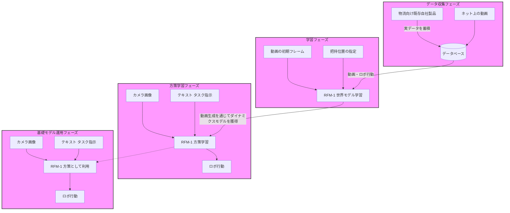
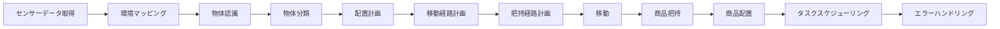

```mermaid
graph LR
    A[初期化と準備] --> B[物体検出と認識]
    B --> C[経路計画]
    C --> D[アプローチと整列]
    D --> E[把持操作]
    E --> F[物体の持ち上げ]
    F --> G[移動と配置]
    G --> H[物体の配置]
    H --> I[リリース]
    I --> J[終了と次タスクの準備]


