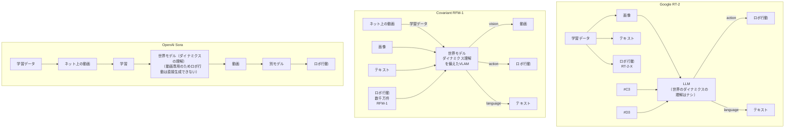

```mermaid
flowchart TD
subgraph Google RT-2
    A3[学習データ] --> B3[画像]
    A3 --> C3[テキスト]
    A3 --> D3[ロボ行動<br>RT-2-X]
    B3 --> E3[LLM
    （世界のダイナミクスの理解はナシ）]
    #C3 --> E3
    #D3 --> E3
    E3 -->|action| F3[ロボ行動]
    E3 --> |language| G3[テキスト]
end

subgraph Covariant RFM-1 
    A2[ネット上の動画] -->|学習データ| B2[世界モデル<br>ダイナミクス理解<br>を備えたVLAM]
    B2 -->|vision| C2[動画]
    B2 -->|action| D2[ロボ行動]
    B2 -->|language| E2[テキスト]
    F2[画像] --> B2
    G2[テキスト] --> B2
    H2[ロボ行動<br>数千万件<br>RFM-1] --> B2
end

subgraph OpenAI Sora
    A[学習データ] --> B[ネット上の動画]
    B --> C[学習]
    C --> D[世界モデル（ダイナミクスの理解）
    （動画専用のためロボ行動は直接生成できない）]
    D --> E[動画]
    E --> F[別モデル]
    F --> G[ロボ行動]
end
```
